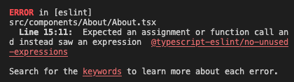
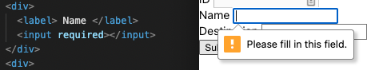
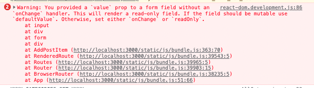
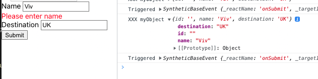

## Day 3

> Cleaning up our useEffect() - `new AbortController()`

- Before navigating to a new component make sure you clear the subscriptions and close the async tasks
- This process will handle the memory leakage
- Using abort controller we can implement this clean up process

```js
import { useEffect, useState } from "react";

const useFetch = (url: string) => {
  const [data, setData] = useState(null);
  const [isLoaded, setIsLoaded] = useState(true);
  const [errorInformation, setErrorInformation] = useState(null);

  useEffect(() => {
    fetch(url)
      // how do i add console.log here
      .then(
        (res) => {
          console.log(res);
          if (!res.ok) {
            throw Error("Failed to fetch the data");
          }
          return res.json();
        } //https://stackoverflow.com/questions/48774535/js-fetch-api-get-method-return-%C6%92-json-native-code
      )
      .then((result) => {
        setTimeout(() => {
          setData(result);
          setIsLoaded(false);
        }, 3000);
      })
      .catch((res) => (setErrorInformation(res.message), setIsLoaded(false)));
    return () => {
      console.log("Clean up");
    };
  }, [url]);

  return { data, isLoaded, errorInformation };
};
```

```js
const useFetch = (url: string) => {
  const [data, setData] = useState(null);
  const [isLoaded, setIsLoaded] = useState(true);
  const [errorInformation, setErrorInformation] = useState(null);

  useEffect(() => {
    const abortCont = new AbortController();

    fetch(url, { signal: abortCont.signal })
      // how do i add console.log here
      .then(
        (res) => {
          console.log(res);
          if (!res.ok) {
            throw Error("Failed to fetch the data");
          }
          return res.json();
        } //https://stackoverflow.com/questions/48774535/js-fetch-api-get-method-return-%C6%92-json-native-code
      )
      .then((result) => {
        setTimeout(() => {
          setData(result);
          setIsLoaded(false);
        }, 3000);
      })
      .catch((res) => {
        if (res.name === "AbortError") {
          console.log("Abort Error");
        } else {
          setErrorInformation(res.message);
          setIsLoaded(false);
        }
      });
    return () => {
      abortCont.abort();
    };
  }, [url]);

  return { data, isLoaded, errorInformation };
};
```


> Navigator => Navigate for redirection and hold history or any redirections

Comes from react-router-dom

Instead of just navigating via the navigator, what if we want to navigate via components? So for example you are on a page and if you press the "Done" button, it will bring you to another page.

If you want to go back to the last page then you say -1 but if you want to go back two pages -2

```js
const IndividualPost = () => {
  const navigate = useNavigate();
  const { id, name } = useParams();
  const backToHome = () => {
    navigate(-1); // means it will go to the last page
  };
  return (
    <div>
      <h1>
        Individual Post Title - {id} - {name}
      </h1>
      <button onClick={backToHome}>Back to home</button>
    </div>
  );
};
```

Therefore we can create our redirect project based on the history

_LEARNING_

```js
const About = () => {
  const navigate = useNavigate();
  const backToPost = () => {
    navigate("/testing/4/emma");
  };
  return (
    <div className={styles.About}>
      <h1>Hi there!</h1>
      <button
        onClick={() => {
          backToPost; // THIS ONE SHOULD BE CHANGED TO backToPort()
        }}
      >
        Go to individual post
      </button>
      <p>I'm Viv, I am a front-end specialist.</p>
      ;
    </div>
  );
};
```



What you can also do:

```js
const goToItem = (id) => {
  navigate("/postitem" + id); // means it will go to the last page
};
```

> input element takes required otherwise gives you this error



> Every `<form>` takes an `onSubmit()` and usually has a `<button>` of `type="submit"` at the end

Something to seriously note about forms is that by default they do this really REALLY fast reload of the page when you click on the button. But this is awesome because on the handleOnSubmit we should say `e.preventDefault()`

> Another common error with forms after you've provided the `<input value={name}>`



So what you have to do here is add an `onChange={(e) => setName(e.target.value)}`



> Make sure the length of name in form is more than 0

```js
{
  name.length === 0 && <div style={{ color: "red" }}>Please enter name</div>;
}
```
