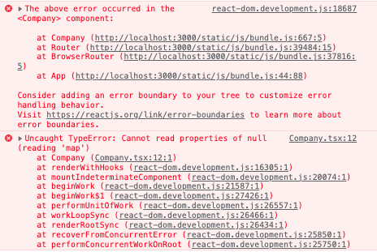

### Day 2 - Loading

Before

```js
<Company companyData={companyData} />
```



Removes error by checking if it has that value

```js
{
  companyData && <Company companyData={companyData} />;
}
```

> Look at how to simply setTimeout() with 3000 milliseconds in the useEffect hook to easily display isLoading div

```js
useEffect(() => {
  fetch("http://localhost:8000/company")
    .then((res) => res.json())
    .then((result) => {
      setTimeout(() => {
        setCompanyData(result);
        setIsLoaded(false);
      }, 3000);
    });
}, []);
```

### Day 2 - Error

> Data not returning - If I _do not_ have my json server running and I run my application I will get this error:


but if I add `.catch((res) => console.log(res.message));` to my useEffect it will come up like this:


>

```js
useEffect(() => {
  fetch("http://localhost:8000/company")
    .then((res) => (console.log(res), res.json()))
    .then((result) => {
      setTimeout(() => {
        setCompanyData(result);
        setIsLoaded(false);
      }, 3000);
    })
    .catch((res) => console.log(res.message));
}, []);
```


> So now if a user were to type in a different URL, our site would not be able to fetch the data.

```js
  useEffect(() => {
    fetch("http://localhost:8000/company1") // THIS LINE
      .then(
        (res) => {
          console.log(res);
          if (!res.ok) { // THIS CONDITION
            throw Error("Failed to fetch the data"); // THIS LINE
          }
          return res.json();
        } /
      )
      .then((result) => {
        setTimeout(() => {
          setCompanyData(result);
          setIsLoaded(false);
        }, 3000);
      })
      .catch((res) => console.log(res.message));
  }, []);

```


Then make sure you set loading to false because it simply just HAS NOT GOT the data.

```js
      .catch((res) => (setErrorInformation(res.message), setIsLoaded(false)));

```

## Custom Hooks

Basically you drag out your whole useEffect hooks and make it into its own class. This is how you extract the valus from the hook by deconstructing it. You can also rename variables like ` data: companyData,`. useFetch() is expecting a string url so we give it that. The url is going to be a dependency on the useEffect so you add that to the [] at the end. When doing your return make sure you give back the values your object is going to need to consume i.e. `return { data, isLoaded, errorInformation };`

```js
const {
  data: companyData,
  isLoaded,
  errorInformation,
} = useFetch("http://localhost:8000/company");
```

## Param Routing

If you had an url `http://localhost:3000/testing` but it was set up as

```js
<Route path="/testing/:id" element={<IndividualPost />}></Route>
```

You would get the following error:


but when we put in `http://localhost:3000/testing/1` then we will get the correct return of the full page. If we put in `http://localhost:3000/testing/2` it would give us the same render page.

You can use a hook called useParams which allows you to extract params from your url that you are looking for and reassign them - awesome!

```js
<Route path="/testing/:id/:name" element={<IndividualPost />}></Route>
```

Then in you IndividualPost you can just:

````js
const { id, name } = useParams(); ```
````
