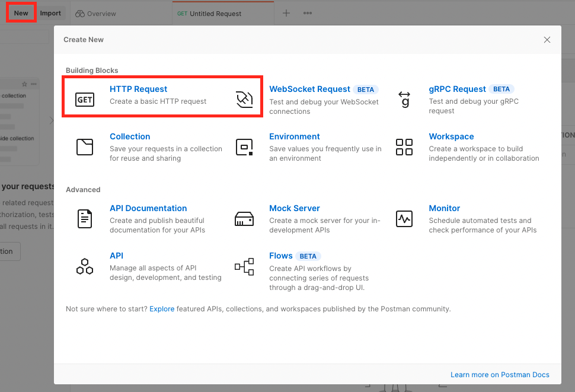
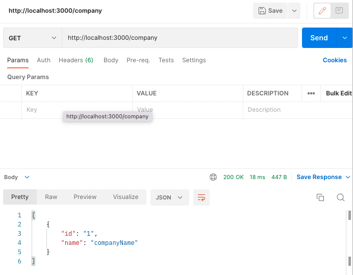
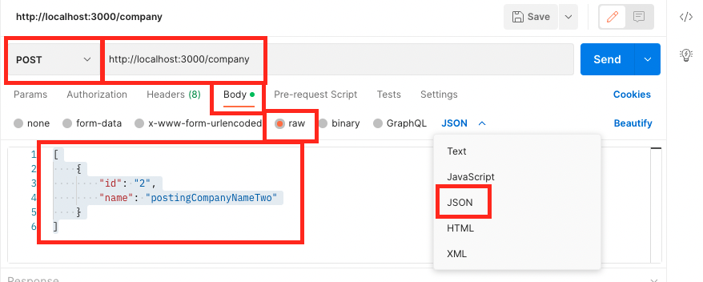
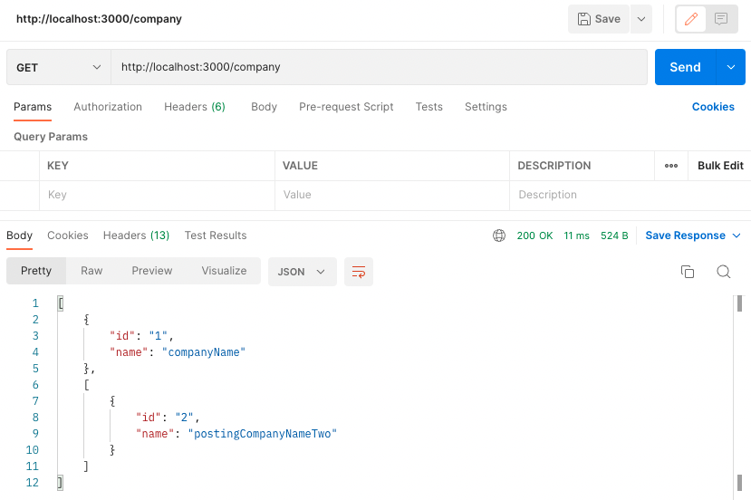
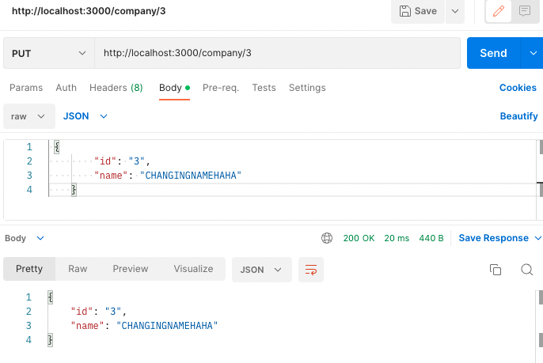
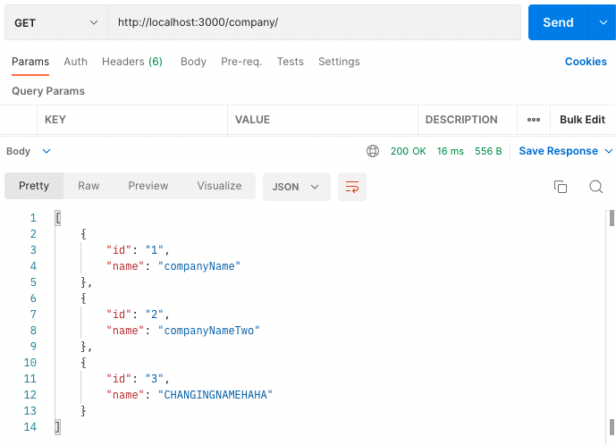

## Learning postman with json server

> Step 1.

Install the following:

`npm install json-server` // doesnt work

`npme install -g json server` // did work

Then once it is in your `package.json` then run the following command and since react app is on port 3000, we will run it on post 8000.

`json-server --watch db.json --port 8000`

By running this command the first time,it generates a db.json in the root of our folder with some default data.


Then is we run it again, we get a list of dummy data and are able to select from multiple resources

`json-server --watch db.json --port 8000`


> Step 2.

Then what you can do is change the data in the db.json and it updates in the terminal with the paths.

> Step 3.

If we have multiple databases in multiple files. You can create a folder called data in your root and create a json file with for example this information:

```js
{
  "company": [{ "id": "1", "name": "companyName" }]
}
```

Then to see data, run the `json-server --watch data/database.json --port 8000`

> Step 4 - Using Postman

1. Create a "personal" workspace
2. Go to "New" and then select



3. Type in your base path and end point i.e. `http://localhost:3000/company` then you can also add paramters `http://localhost:3000/company/1` or else try out fake ones and see what you get `http://localhost:3000/company/789` We should get an empty response if it is not in our json.



4.  To add this unkown data what you do is copy the copy

```js
[
  {
    id: "1",
    name: "companyName",
  },
];
```

And create a "post" in a new tab. Then select body > raw > Text and select JSON



Then paste you data object into the canvas but change the data to what you desire

```js
[
  {
    id: "2",
    name: "postingCompanyNameTwo",
  },
];
```

> Step 5 - After post



201 response means that it was created: The request has been fulfilled and resulted in a new resource being created.

200 means we have a successful get response. Standard response for successful HTTP requests. The actual response will depend on the request method used. In a GET request, the response will contain an entity corresponding to the requested resource. In a POST request the response will contain an entity describing or containing the result of the action.

Add another object with id=3

> Step 6 - Put method

Use an ID in your database and change the name of the ID and make sure you target that specific ID in your url.





> Step 7 - Delete

Just target the id that you want to delete.
