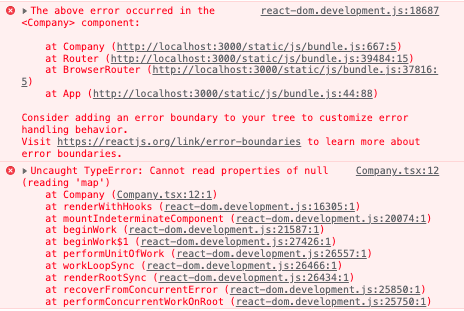

### Day 2 - Loading

Before

```js
<Company companyData={companyData} />
```



Removes error by checking if it has that value

```js
{
  companyData && <Company companyData={companyData} />;
}
```

> Look at how to simply setTimeout() with 3000 milliseconds in the useEffect hook to easily display isLoading div

```js
useEffect(() => {
  fetch("http://localhost:8000/company")
    .then((res) => res.json())
    .then((result) => {
      setTimeout(() => {
        setCompanyData(result);
        setIsLoaded(false);
      }, 3000);
    });
}, []);
```

### Day 2 - Error
