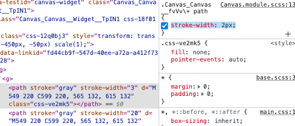

# November 2022

## Nov 1, 22

1. When writing tests

We use `get` when we know the component is in the document and we use `query` when we say not.inTheDocument. `get` will return the DOM in our terminal and return an error but `query` will just return null if it can not find it.

## Nov 7, 22

> `join` doesn't add a separator at the end

```js
<div className={styles.MyStyleName}>[{value.join(", ")}]</div>
```

> What a substring looks like in javascript. Similar to length-1.

```js
.slice(0, -1)
```

> When creating a new array. If you want to two arrays into one array, make sure you do the spread operator i.e. `...`.

```js
items={[...value, ...DUMMY_VALUE]}
```

If you set your type to `() &rarr; void`, when you are testing it and the type is required, you can do `() &rarr; undefined`

> When wanting to rebase

1. Commit your changes
2. Pull from main and makes sure its up to date
3. Go back to your branch and say `git rebase main`
4. Then since there will be no changes to commit do `git push --force`
5. Look at screenshot git_rebase.png to see a successful rebase output
6. For more information https://docs.gitlab.com/ee/topics/git/git_rebase.html#force-push

> Network Requests

Network requests that have come up when entering data
The HyperText Transfer Protocol (HTTP) 503 Service Unavailable server error response code indicates that the server is not ready to handle the request
The HyperText Transfer Protocol (HTTP) 504 Gateway Timeout server error response code indicates that the server, while acting as a gateway or proxy, did not get a response in time from the upstream server that it needed in order to complete the request.

```js
it("should itemSelectedIsOpen to true once cog is clicked", async () &rarr; {
  const MOCK_ISOPEN = jest.fn();
  const { getByLabelText } = render(
    <MicroCta
      aria-label="cog-button"
      alt="transparent"
      size="sm"
      onClick={MOCK_ISOPEN}
    >
      <Icon.Cog />
    </MicroCta>Markdown Mode

  );
  const cogButton = getByLabelText("cog-button");
  await userEvent.click(cogButton);
  expect(MOCK_ISOPEN).toHaveBeenCalledTimes(1);
});
```

> Fun things worth doing:

Create a swagger spec

## Nov 8, 22

- Line 44 is where the code coverage is needed. Sometimes you can have from 32-44 lines you need to test.


- Viewing your ReadMe.md with the preview button in VS code.


## Nov 9, 22

> Server-side request forgery (SSRF)

You can visit a website, your browser is persuaded/ loaded from another resource to send requests to another site on your behalf. It used to be a big thing where developers were less aware of different request types. Now it can still be a thing. Where if you have wifi people can make different requests with that. An attack by the user frontend via the user browser. Attacker can get you to do things on your own behalf. CSRF &rarr; Attack on the client. SSRF &rarr; Attack on the server.

> Shortcuts of VS Code

To be honest sometimes it works and sometimes it doesnt and I get confused so I am just going to make a note of it here: Command Shift L allows us to do variable refactors.

> @TODOs in the codebase
> If youre going to have a TODO always have a link to the ticket it is referring to. You can set this up in linting apparently

> JSDoc versus normal comment

```js
**
 * @property {number} listHeight must match Column__TableList height
 * @property {number} itemSize must  must match ListItem height
 *
 **/

const defaultOptions: OptionProps = {
  listHeight: 354,
  itemSize: 48,
  [...]

```

```js
/** @keyword This is jsdoc that will come up when you hover over*/
```

versus

`// this is a comment`

You should not have an @ outside the js doc statement. Its not a keyword by javascript.

> Testing

Rather than destructure from render all the time, we should import screen from the test-utils import and then we get access to all these methods e.g. screen.getByText(). Deconstructed for all.

> Fun CSS
> text-overflow: ellipsis;

> `:global`
> global name not a module name. should not be used outside this condition. Used theme but should never be used outside of file. Breaking the idea of having a module. Only redefining the things based on theme.

> Translation

```js
 allItemsLabel: t('translation:itemSelector.allItemsLabel', {
                  label: parameter
                }),
```

`"allItemsLabel": "{{ label }}",`

> If empty array

items={data?.editorColumns[0].options ?? []}

> Plugin for i18y

https://marketplace.visualstudio.com/items?itemName=lokalise.i18n-ally

> Ignoring a line for typescript

`@ts-expect-error comment after this`

## Nov 14, 22

> Mocking data response from a hook

First you need to import the whole file/bundle where your hook is by doing \* and then renaming it as shown below in imports. Then what spy does is it "spies on"/ monitors every call to this hook in the spyOn block. Jest monitors it instead of returning it it will just return the mock return values.

```js
import * as GetOptions from "api/hooks/useGetOptions";

const spy = jest
  .spyOn(GetOptions, "useGetOptions")
  // .mockReturnValue(MOCK_RETURNVALUE)
  .mockImplementation(() &rarr; MOCK_RETURNVALUE);
```

LOOK AT HOW `as` is used here:

```js
 const spy = jest
      .spyOn(GetOptions, 'useGetOptions')
      .mockReturnValue(
        MOCK_RETURNVALUE as UseQueryResult<GetOptionsResponse>
      )

expect(spy).toHaveBeenCalled() // otherwise linting issue
```

> _Learning is part of the health check of Retro_

> Terminal Things

```js
rm -r fileIWantToDelete
git rm fileIWantDeleted
ls -al // views hidden files in the repo
```

> Typescript: Knowing when to use Partial

> Testing

- Wrapping everything in forEach when writing tests that have similar parameters. Just make two objects with the same values then put those two objects into a generic object. Then say `thatObject.forEach( ({deconstuctParamsFromObject}) &rarr; { // do shit })`

```js
  'data-testid': dataTestId
```

> Favourite VS Code Command Refactor

- SHIFT, CMD and L

> Quick one on data structures

- `const addingTwoArrays = [...ObjectName, AnotherObject]`

- `const justOneObject = [ObjectName]`

Making your mocks into a support class then import it in which is needs to be used in.

```js
export const mockJobTypeOneComponent = {
  name: "orchestration",
  instanceId: "14360",
};

export const mockJobTypeTwoComponent = {
  name: "orchestration",
  instanceId: "14360",
};

export const bothMockComponents = [
  mockJobTypeOneComponent,
  mockJobTypeTwoComponent,
];
```

Then you can do a

```js
import {bothMockComponents} from './somewhere'
bothMockComponents.forEach({name, instanceID}) &rarr; {Do Stuff}`
```

## Nov 15, 22

Swagger is great for documentation. This is dummy information build with html and js.

https://petstore.swagger.io/

yaml?

Every end point has to be proceded by the `[ Base URL: petstore.swagger.io/v2 ]` / ` https://petstore.swagger.io/v2/swagger.json`

You can get a response type i.e. it can be in json or xml.

> Normal table

| Syntax    | Description |
| --------- | ----------- |
| Header    | Title       |
| Paragraph | Text        |

> Alignment on table

| Syntax    | Description |   Test Text |
| :-------- | :---------: | ----------: |
| Header    |    Title    | Here's this |
| Paragraph |    Text     |    And more |

> Swagger versus Postman

Swagger is an API specification & Postman is an API Client and appropriate for API first development while,

| Swagger                                                                                                                                                                                                                                                                                                                                                                              | Description                                                                                                                                                                                                                                                                                                                 |
| ------------------------------------------------------------------------------------------------------------------------------------------------------------------------------------------------------------------------------------------------------------------------------------------------------------------------------------------------------------------------------------ | --------------------------------------------------------------------------------------------------------------------------------------------------------------------------------------------------------------------------------------------------------------------------------------------------------------------------- |
| Swagger is an API specification. Swagger is basically a description language that is used for the description of RESTful API                                                                                                                                                                                                                                                         | Postman is an API Client and appropriate for API first development while Postman is appropriate for testing such API based on specifications. Postman is computer software that was built with the purpose of creating and testing API’s. Using postman request can be made to the server and the response can be received. |
| Helps specify request types such as get, post, put, request paths (urls), paramters with respective names or descriptions, examples of bodies or associated definitions, expected responses                                                                                                                                                                                          | Users can store information to run tests in different environments. Users can store data to use in other tests. It can move tests and environments to code repositories easily.                                                                                                                                             |
| Swagger does the documentation in a standard way (OpenAPI) means in a machine-readable language. Swagger provides you the way to automate the documentation which means it picks up the methods with Get, Put, Post, Delete attributes and prepares the documentation by itself. And as you have done any change to any method, Swagger documentation will automatically be updated. |

## Nov 17, 22

> Translations

You can provide a fallback translation for when a key doesn't exist e.g.:

```js
t(`components.${componentId}.displayName`, t("unknownComponent"));
```

Will return "Unknown component" when it can't find a translation with the provided key.

OR you can also do that by just passing the keys!

t([`components.${componentId}.displayName`, 'unknownComponent'])

> How does the backend talk to the frontend?

This tells us that we are going to run on the test i.e. local environment and we are going to use

```js
PORT = 3443;
HOST = grape.appName - local.companyname.com; //(no spaces)
HTTPS = false;
REACT_APP_ENVIRONMENT = "test";
REACT_APP_USE_MOCKS = true;
```

When you run your app, it will check if it is true, if it is true then `setupWorker` will be activated which will act as an interceptor to use mock data instead of your backend data. All of the hooks will be intercepted. Right now we are using two backends i.e. BE Fork and BE Spring that talk to WorkingTreeStore i.e our DB. We also have CIS extending our BE which gives us the data structure and types of our data. WorkingTreeStore updated these params with the values.

```js
if (process.env.REACT_APP_USE_MOCKS === 'true' && !('Cypress' in window)) {
  const worker = setupWorker(
    ...useGetComponentXHandlers,
```

In the backend there should be an xlm file that you can link up with swagger.

Using postman allows you to send CRUD operations to backend whether that be `useClient()` or `useSpringClient()`. Check this.

> Working with VIM

In Vim, you start out in normal mode.

**Ready to edit**

From there, you can access insert mode by pressing `i` and can edit the text as you'd normally expect. When done editing text, press esc to return to normal mode

**Save changes**

In normal mode, type `:wq` and press Enter to 'Write' and 'Quit' out of Vim.

**Horrible Mistake! Need to exit without changes!**

To avoid applying your changes in Vim, you'd normally use `:q!` (quit without saving, forced) in normal mode, but that won't work for interactive rebasing in the way you'd expect. Instead, you must delete all lines from the text before using `:wq` or `:q!`. An easy way to delete all lines at once in normal mode would be to follow the answer selected from This Question

# Linting disable next line

```
// eslint-disable-next-line
```

do not do above do this:

```
    // @ts-expect-error write your comment here
```

## Nov 18, 22

## Thoughtworks Radar

- Get people together which practices and processes are working for them and sort them into 4 categories:

1. Hold: We do not recommend this due to better practices/ this is something we need to stop doing as an industry
2. Access: Interesting. Want to see what it could be capable of. Not to the point where a team is working with it.
3. Trial: Afew of their products and reporting how successful it is. Spike phase.
4. Adopt: This is brilliant and what we recommend you should use.

_Obvs recommend go away and do your own trialing_
They do this accessment every 6 months.

How do they choose i.e. whats their dataset? They have regular meet ups. The people in charge of the office i.e. London etc, they will ask their teams and this will build up their list. It is more about the emerging technologies.

4 Quads:
Techniqhes &rarr; How we build software
Platforms &rarr; System they use Cypress/ Kubernetes
Tools &rarr; K6 Performance Testing / Gittogether/ AWS
Languages/Frameworks &rarr;

**What is Design Tokens?** (in trial)
When a UX team design, they take your colours, your corner i.e. config stored in one place. Design Token storage is a key value map that you can refer back to in your code base. We kindof do this already with our colours. More could be done on this.

CSS variables &rarr; You cant have an object in CSS variables
CSS in JS is the best

> Visual Regression Testing

We use PERCY in 2 ways:
Percy: Run against components we add in isolation
ETLD: With latest running against local host, you can do the full page visual snapshots. Now you can pass an argument to scope it to specific element on the page.
Your not just loading the whole component, youre loading the page but looking at the specific feature

> SPA by default?

We do this by default. It allowed teams to have full control over their codebase. We also have baseplate &rarr;; That we will move to a micro-frontend architecture. People started using create-react-app then people have moved on to next and now astro &rarr; static site generator. Introducing routing issues, pages rendering the wrong thing, you are not giving it a framework. The maybe answer, when you decide something is an SPA you are making an architectural decision to call it that regardless of what your project is.

> BUN/ Dino (different ways of running ts &rarr; ts run time)

- They are faster

> How to do arrows in markdown

Up arrow (↑): &uarr;
Down arrow (↓): &darr;
Left arrow (←): &larr;
Right arrow (→): &rarr;;
Double headed arrow (↔): &harr;

> When talking about enterprise software

- Longevity of framework
- What we might see if node adopting some of these features
- We do not use node in anything other than lambdas

> Online services for formatting or pasing code

- Thoughtworks are saying here &rarr; If the site is going to take your data. If that JSON snippet contains an API key then it might steal this. SECURITY. jwt.io

> State of JS

https://stateofjs.com/en-us/

https://2021.stateofjs.com/en-US/libraries/front-end-frameworks

> Yjs &rarr; https://yjs.dev/ (kindof insane)

CRDT &rarr; Conclict Free Replicated Data Type algorithm
Similar to google docs
Collaboration online
Wrapper library you can put into your project
Miro uses the old algorithm
Whos using it? https://github.com/yjs/yjs#who-is-using-yjs

> ReactQuery

We are in adopt. Dont use react query to do your state management, good for caching and stuff but not good for storing your state.

> Ladle

Storybook alternative. Faster, neater, smaller version of storybook. Looks alot more base html. It does not support MDX &rarr; on list of thing to do. Backed by veet.

> Jest switch statement

toBe returns specific value
toStrictEqual for arrays

make sure you export the functions

```js
describe("ETLNode", () => {
  it("should return correct conditions when passing connector hint through", () => {
    expect(getOutputPorts(ConnectorHint.SuccessFail)).toStrictEqual([
      "success",
      "unconditional",
      "failure",
    ]);
    expect(getOutputPorts(ConnectorHint.Unconditional)).toStrictEqual([
      "unconditional",
    ]);
    expect(getOutputPorts(ConnectorHint.Conditional)).toStrictEqual([
      "unconditional",
    ]);
  });
});
```

> Grep

- `history` // into terminal to see last commands
- `history | grep live` // grep is a search
- `grep `
- `man grep`

## Nov 21, 22

> You can use css to override the styling of an svg. It doesnt even look like the svg has changed in the dom but it has. CAN BE CHANGED "PROGRAMATICALLY". You cant change all the properties in an svg this way e.g. stroke="red"



> To clear your jest cache if you are getting old files coming up in your code coverage

`npm ./node_modules/.bin/jest --clearCache`

> When testing conditionals. When using an array use toStrictEqual

```js
import { getOutputPorts } from "../../EtlNode";
import { ConnectorHint } from "job-lib/types/Job";
describe("ETLNode", () => {
  it("should return correct conditions when passing connector hint through", () => {
    expect(getOutputPorts(ConnectorHint.SuccessFail)).toStrictEqual([
      "success",
      "unconditional",
      "failure",
    ]);
    expect(getOutputPorts(ConnectorHint.Unconditional)).toStrictEqual([
      "unconditional",
    ]);
    expect(getOutputPorts(ConnectorHint.Conditional)).toStrictEqual([
      "unconditional",
    ]);
  });
});
```

> callingAMethod.toBeInstanceOf(itemItShouldBeAnInstanceOf)

```js
describe("Custom Link Styling", () => {
  it("should activate generateModel", () => {
    const advancedLinkFactoryInstance = new AdvancedLinkFactory();
    const generateModel = advancedLinkFactoryInstance.generateModel();
    expect(generateModel).toBeInstanceOf(AdvancedLinkModel);
  });
});
```

## Nov 22, 2022

> look at the css nesting

```js
 g[data-linkid] path {
    stroke-width: 10px;
  }
```


> path is worth exploring

> Some panel should be virticle(form) and some horizontal (list)

> If you are using something all the time on the page then you need it to be very visible

> If you do it once at the start

> **UX: Affordance**

Idea that an object should tell the user what it does. The natural feature of a UI to tell the user what it is for. When a widget doesnt tell the user what it does you say the afforance is failing.

> UX Very important!

Why are they in the same location? Why is some double click and some single? Why are some double click and some are drag and drop. You should bring a panel closer to the layers of the focus on the page and they it should leave the page it should disappear.

> Key

User-center design.

"We do what users want" -> Not true. Most of the time they dont know what they want. They are bias. The core should be A/B testing. If we user comes to you to tell they want something a certain way because they are used to METL. They might not understand you can do something better cuz they dont know. You need the data but you need to be careful what you decide on.

> Survivorship Bias

Armour too heavy on flight. A report about where the plain got bullet holes. Collecting data. Concentration where are all the holes in the plain? Where do we increase the armour well we look for when we have the most bullet holes. Data of every plain that came back alive from the missions, you are not looking in the plain that never came back. The holes are not that important because they made it back but the planes that didn't come back we don't have the data. So they decided on the exact opposite of the plain. Not because the data was wrong but analysis and interpretation was bias because you were solely relying on the survivers. We get response by people who are the only ones who are replying to us. Your analaysis is only based on who volunteer to get back. More likely to get positive feedback than negative. If the users are angry or the "we don't know" are unlikely to give us feedback. The _visible_ part of the ice berg. People might drop out before the end so you never get the feedback. You only know the people who stayed on why they stayed on.

**Abraham Wald** was the guy who saw it.

## Nov 23, 2022

> How often should we deploy to preprod prod? Especially when another persons PR is merging on top of mine.

- Once you have merged your PR, your code is on dev.
- You log on dev and check your changes on there.
- Then you deploy to preprod, open the preprod version of the app and check your changes.
- Then you deploy to prod, open the prod version and check your changes.
- After the PR merge, there is nothing left to do on your local

## Nov 28, 22

> Redux toolkit: An external place to store state without prop drilling. Read documentation to quickly understand - Not complicated https://redux-toolkit.js.org/tutorials/quick-start


1. Action
2. Root reducer
3. Store
4. Dom changes

Flux pattern:

1. Action
2. Dispatcher
3. Store
4. View

Root reducer is the big object that holds all of the other reducers e.g. shop reducer, home reducer.. (a slice of state)

This is why it is called the redux store

A reducer always has a switch statement. It takes in the current state and action. Then returns the new state.


https://codesandbox.io/s/modest-https-h7x3m?file=%2Fsrc%2Fredux%2Fcounter.js%3A125-126

> If you want to see the window object in console type in `document.defaultView`

https://developer.mozilla.org/en-US/docs/Web/API/Document/defaultView

https://developer.mozilla.org/en-US/docs/Web/API/Window

## Nov 30, 22

> Navigation

Is there any ticket regarding using react-helm or similar approaches to change the title of the document based on routing, so that “back” navigation steps have a meaningful rendering in the browser?

> Sneak

Picked up third party vulnerabilities. Monitors to make sure we are using the latest react because people are always trying to break into react and react people have been working on it to make sure it is not breakable.
