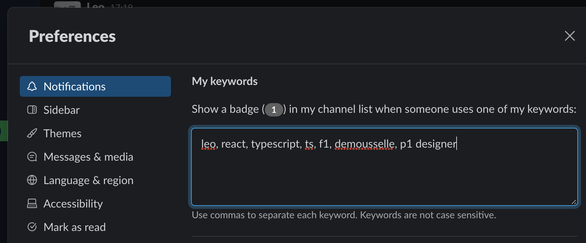

# August

```js
const camelToKebabCase = (s: string) =>
  s.replace(/[A-Z]/g, (l) => "-" + l.toLowerCase());

export default camelToKebabCase;
```

```js
import camelToKebabCase from "./camelToKebabCase";

describe("camelToKebabCase", () => {
  it("should return a kebab case string", () => {
    expect(camelToKebabCase("testString")).toBe("test-string");
  });
});
```

helps you find any file on your computer. in our case psql
sudo find / -name "psql" -type f 2>/dev/null

know the difference between bash and zsh

> difference between onClick & onChange

onChange and onClick are both event handlers in React that serve different purposes:

onChange:
The onChange event handler is used with form input elements like text inputs, checkboxes, and radio buttons. It is triggered whenever the value of the input element changes. For example, when a user types something into a text input or selects a different option in a dropdown, the onChange event is fired. It is commonly used to capture user input and update the state or perform actions based on that input.

onClick:
The onClick event handler is used with interactive elements like buttons, links, and other clickable elements. It is triggered when the element is clicked by the user. This event handler is commonly used to trigger actions or functions when the user interacts with the element, such as submitting a form, navigating to a different page, or performing some operation.

In your code snippet:

jsx
Copy code
<button
type="button"
class="btn btn-warning"
data-dismiss="modal"
onClick={updateDescription}

> Save
> </button>
> The onClick event handler is attached to the "Save" button. This means that when the user clicks the "Save" button, the updateDescription function will be called. In this context, clicking the "Save" button will trigger the updateDescription function and execute the code within it, which includes sending a PUT request to update the description and reloading the page.

If you were using an input element like a text input, you might use onChange to track changes to the input's value as the user types. However, for

> Content type
> "Content-Type": "application/json": This specific header indicates the media type (or content type) of the data that is being sent in the request body. In this case, "application/json" indicates that the content is in JSON format. This is important for the server to understand how to parse the request body.

query key that unique identifies this query

> Params and body

Params correspond to the request parameters that are appended to the request URL.they are most used with GET requests. On the other hand, Body is the actual request body (usually it defines the request payload or the data that needs to be processed by the request). PUT and POST requests read usually the data from the body of the request and not from the params.

> All the ways to fix this error:
> "ERR_CONNECTION_REFUSED"
> https://www.hostinger.com/tutorials/err_connection_refused


```js
if (warehouses) {
  if (!warehouses.hasOwnProperty(projectWarehouse)) {
    return false;
  }
}
```

if we dont need it we can add an underscore

```js
const name = (_something) => {};
```

Object.assign

lodash
import cloneDeep from lodash

> VERY IMPORTANT: how to deconstruct on multiple levels:

const { metadata: {parameters} } = cloneDeep(response)

> Can also
> const output = cloneDeep

output.metadata.parameter = output.metadata.parameter.filter(() => {})

const valid = data?.warehouse as string

this gets rid of undefined

```js
import { mockOrchestrationValues } from '__test-utils__/mockOrchestrationValues'

import { mockCustomIsParameterVisible } from 'api/hooks/useGetComponentMetadata/__handlers__/mockComponentsMetadata/mockCustomIsParameterVisible'
import {
  ComponentMetadata,
  EditorType,
  ParameterDataType,
  VisibleWhenOperator
} from 'api/hooks/useGetComponentMetadata/types'
import { mockOrchestrationJob } from 'api/hooks/useGetJob/__handlers__/mockOrchestrationJob'

import { OrchestrationComponentInstance } from 'job-lib/types/Job'
import { dplParamsKey } from 'job-lib/types/Parameters'

import { isParameterVisible } from './isParameterVisible'

const slots = {
  default: 1,
  operatorNever: 2,
  operatorUnknown: 3,
  operatorEqualsMatch: 4,
  operatorEqualsNoMatch: 5,
  operatorNotEqualsMatch: 6,
  operatorNotEqualsNoMatch: 7,
  operatorINExists: 8,
  operatorINDoesNotExist: 9,
  operatorNOTINNotExist: 10,
  operatorNOTINExists: 11,
  operatorHASVALUE: 12,
  operatorMATCHESREGEXPATTERN: 13,
  operatorMATCHESREGEXPATTERNNoMatch: 14,
  operatorDYNAMICVISIBILITYLOOKUP: 15,
  operatorParamEmpty: 16,
  operatorEqualsDPLID: 17
}

const mockOrchestrationComponent: OrchestrationComponentInstance = {
  ...mockOrchestrationJob.components[mockOrchestrationValues.CREATE_TABLE_0.id],
  parameters: {
    1: {
      slot: 1,
      name: 'nameFoo',
      visible: true,
      elements: {
        1: {
          slot: 1,
          values: {
            1: {
              slot: 1,
              type: 'STRING',
              dataType: ParameterDataType.TEXT,
              value: 'valueFoo'
            }
          }
        }
      }
    },
    2: {
      slot: 2,
      name: 'nameBar',
      visible: true,
      elements: {
        1: {
          slot: 1,
          values: {
            1: {
              slot: 1,
              type: 'STRING',
              dataType: ParameterDataType.TEXT,
              value: 'valueBar'
            }
          }
        }
      }
    },
    3: {
      slot: 3,
      name: 'nameRegex',
      visible: true,
      elements: {
        1: {
          slot: 1,
          values: {
            1: {
              slot: 1,
              type: 'STRING',
              dataType: ParameterDataType.TEXT,
              value: '.*notMat$'
            }
          }
        }
      }
    }
  }
}

describe('visibleWhen using DPL parameters', () => {
  const mockDPLParameters = {
    componentName: 'mock component',
    struct: {
      childProperty: 'mock value',
      childProperty2: 'mock value 2'
    },
    mockParam: 'value2'
  }
  const mockDPLComponentInstance = {
    parameters: {
      1: {},
      2: {
        name: dplParamsKey,
        elements: {
          1: {
            values: {
              1: {
                value: JSON.stringify(mockDPLParameters)
              }
            }
          }
        }
      }
    }
  } as unknown as OrchestrationComponentInstance
  const mockNestedParameterMetadata = {
    parameters: [
      {
        id: 'struct',
        dplID: 'struct',
        resourceID: 'mockResourceId',
        metlSlot: 1,
        dataType: ParameterDataType.STRUCT,
        editorType: EditorType.PARAMETER_GROUP,
        optional: false,
        childProperties: [
          {
            id: 'child-property',
            dplID: 'childProperty',
            resourceID: 'mockResourceId',
            metlSlot: 1,
            dataType: ParameterDataType.TEXT,
            editorType: EditorType.FREETEXT,
            optional: false,
            visibleWhen: [
              {
                param: 'childProperty2',
                operator: VisibleWhenOperator.EQUALS,
                value: 'mock value'
              }
            ]
          },
          {
            id: 'child-property2',
            dplID: 'childProperty2',
            resourceID: 'mockResourceId',
            metlSlot: 2,
            dataType: ParameterDataType.TEXT,
            editorType: EditorType.FREETEXT,
            optional: false,
            visibleWhen: [
              {
                param: 'childProperty',
                operator: VisibleWhenOperator.EQUALS,
                value: 'mock value'
              }
            ]
          }
        ]
      },
      {
        id: 'mock-param',
        dplID: 'mockParam',
        resourceID: 'mockResourceId',
        metlSlot: 2,
        dataType: ParameterDataType.TEXT,
        editorType: EditorType.FREETEXT,
        optional: false
      },
      {
        id: 'mock-param2',
        dplID: 'mockParam2',
        resourceID: 'mockResourceId',
        metlSlot: 3,
        dataType: ParameterDataType.TEXT,
        editorType: EditorType.FREETEXT,
        optional: false,
        visibleWhen: [
          {
            param: 'mockParam',
            operator: VisibleWhenOperator.IN,
            value: ['value1', 'value2']
          }
        ]
      }
    ]
  } as unknown as ComponentMetadata

  describe('Visibility for nested parameter', () => {
    it.each([
      {
        parameter: 'childProperty',
        path: ['struct'],
        expected: false
      },
      {
        parameter: 'mockParam2',
        path: [],
        expected: true
      },
      {
        parameter: 'childProperty2',
        path: ['struct'],
        expected: true
      },
      {
        parameter: 'childProperty2',
        path: ['struct', 'unknown'],
        expected: false
      }
    ])(
      'should return the correct visibility for a DPL parameter',
      ({ parameter, path, expected }) => {
        const result = isParameterVisible(
          parameter,
          mockDPLComponentInstance.parameters,
          mockNestedParameterMetadata,
          path
        )
        expect(result).toBe(expected)
      }
    )
  })
})

describe('VisibleWhen operators', () => {
  it.each([
    {
      testCase: 'when there is no metadata in the component-name parameter',
      expectedResult: true,
      slot: slots.default
    },
    {
      testCase:
        'should return false when the visibleWhen operator is NEVER in the new-table-name parameter',
      expectedResult: false,
      slot: slots.operatorNever
    },
    {
      testCase:
        'should show a field if the operator is unknown e.g. FOO in the table-type parameter in visibleWhen',
      expectedResult: true,
      slot: slots.operatorUnknown
    },
    {
      testCase: 'should return true when the parameter value does match',
      expectedResult: true,
      slot: slots.operatorEqualsMatch
    },
    {
      testCase: 'should return false when the parameter value does not match',
      expectedResult: false,
      slot: slots.operatorEqualsNoMatch
    },
    {
      testCase: 'should return false when the parameter value matches',
      expectedResult: false,
      slot: slots.operatorNotEqualsMatch
    },
    {
      testCase: 'should return true when the parameter value does not match',
      expectedResult: true,
      slot: slots.operatorNotEqualsNoMatch
    },
    {
      testCase: 'should return true when the parameter value exists',
      expectedResult: true,
      slot: slots.operatorINExists
    },
    {
      testCase: 'should return false when the parameter value does not exist',
      expectedResult: false,
      slot: slots.operatorINDoesNotExist
    },
    {
      testCase: 'should return true when the parameter value does not exist',
      expectedResult: true,
      slot: slots.operatorNOTINNotExist
    },
    {
      testCase: 'should return false when the parameter value does exist',
      expectedResult: false,
      slot: slots.operatorNOTINExists
    },
    {
      testCase: 'should return true when the parameter value exists',
      expectedResult: true,
      slot: slots.operatorHASVALUE
    },
    {
      testCase:
        'should return true when the parameter value matches the regex pattern',
      expectedResult: true,
      slot: slots.operatorMATCHESREGEXPATTERN
    },
    {
      testCase:
        'should return false when the parameter value does not match regex pattern',
      expectedResult: false,
      slot: slots.operatorMATCHESREGEXPATTERNNoMatch
    },
    {
      testCase: 'should return true until implemented',
      expectedResult: true,
      slot: slots.operatorDYNAMICVISIBILITYLOOKUP
    },
    {
      testCase: 'should return true when visibleWhen contains no parameters',
      expectedResult: true,
      slot: slots.operatorParamEmpty
    },
    {
      testCase:
        'should be able to determine that a parameter is visible using a dplId in the columns parameter',
      expectedResult: true,
      slot: slots.operatorEqualsDPLID
    },
    {
      testCase: 'should return true when visibleWhen contains no parameters',
      expectedResult: true,
      slot: slots.operatorParamEmpty
    },
    {
      testCase:
        'should return false when the visibleWhen operator is NEVER in the new-table-name parameter',
      expectedResult: false,
      slot: slots.operatorNever
    },
    {
      testCase:
        'should show a field if the operator is unknown e.g. FOO in the table-type parameter in visibleWhen',
      expectedResult: true,
      slot: slots.operatorUnknown
    },
    {
      testCase:
        'should return true when visibleWhen is null in the component-name parameter',
      expectedResult: true,
      slot: slots.default
    }
  ])(
    'should return the $expectedResult $testCase',
    ({ expectedResult, slot }) => {
      const parameters = mockOrchestrationComponent.parameters
      const metadata = mockCustomIsParameterVisible.metadata
      const result = isParameterVisible(slot, parameters, metadata)
      expect(result).toBe(expectedResult)
    }
  )
})

it('should return true when there is no metadata in the component-name parameter', () => {
  const parameters = mockOrchestrationComponent.parameters
  const result = isParameterVisible(slots.default, parameters)
  expect(result).toBe(true)
})

```

> flat() into a single-level array of values.

> Checking for ndefined

```js
const values = row.values !== undefined ? row.values : [];
```

can just be written as :

```js
const values = row.values ?? [];
```

if (rowData?.values) {

Leo Demousselle
We should avoid the usage of conditional logic inside of a test, the whole test needs to be assertive and specific on what we are doing. If we expect values to not be defined, we should have a test against that case. If we are testing for values that do exist, we should have another test case for that, but we shouldn’t be doing conditional checks, otherwise we’d need to test our test!

You’re using a mock and you know whether this will be undefined or not. If by any chance you’re getting lint-errors about the type, you should know whether the lint is correct or not, and based on that, you can force the type because you have control on what the test is being fed with!

        // Check if rowData and rowData.values are defined
        rowData.values.forEach((cell) => {
          expect(within(row).queryAllByText(cell)).not.toBeNull()

> Please do:

```js
if (!values.length) {
```

instead of:

```js
if (values.length === 0) {

```

> For sonarcloud:

rowIndex and cellIndex are numbers. It’s not recommended to use indexes as keys but in this case there’s not much else we can do. these have been parsed as strings so sonar has one less thing to pick up on.

Could you parse these as strings so Sonarcloud has one less thing to pick on?

Do not do:

```js
        <TableCell
              key={`cell-${rowIndex}-${cellIndex}`}
              className={classes.SampleComponentResults__Cell}
              id={cellIndex}
            >
```

Please do:

```js
<TableCell
key={`cell-${String(rowIndex)}-${String(cellIndex)}`}
className={classes.SampleComponentResults\_\_Cell}
id={cellIndex} >
```

![./fctypes]

Learning

- When running scripts in package.json you always put npm run \_\_ the script

```js
 "scripts": {
    "start": "react-scripts start",
```

To sign into postgres:
psql -U postgres

json webtoken allows us to stay signed in even when we navigate away from it

will listen for constant changes
"scripts": {
"start": "nodemon server.js"
},

"scripts": {
"start": "node server.js" // will run script once
},

<fieldset>

ephemeral div

> type predicates

```js
export const isComponentNode = (node?: EtlCanvasNode): node is ComponentNode =>

```


