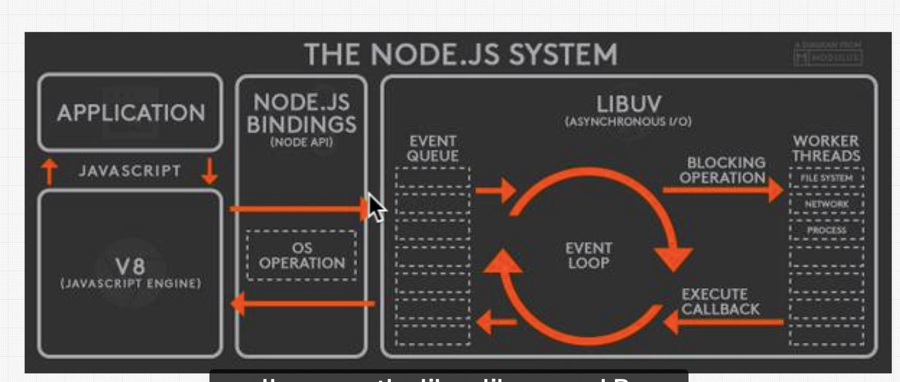
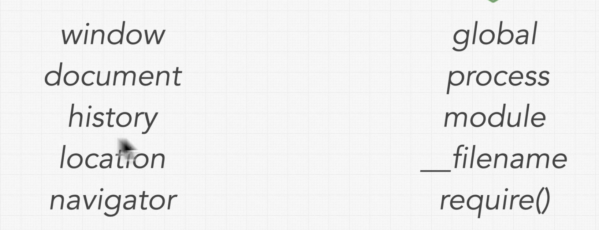

# December

> How do you run javascript?
> Run this piece of javascript for me. The browser that came preinstalled on the computer allows us to run javascript.

Write instructions -> Our computer can do something with the instructions. We need a way for out computer to understand i.e. a browser i.e. a built in javascript engine. A browser runs a js engine.

Can you still run javascript without a browser?

Node was born in 2009

> What is a javascript runtime?
> A javascript environment. Node has the V8 engine that makes javascript runs very well.

> libUV
> A library dont with node.js that allows us to do a lot of other cool things

> Is javascript a runtime?

A browser contains a JS engine e.g. Chrome V8. The engine implements a JS runtime, which includes the call stack, heap and event loop. The browser also includes a set of APIs that augment the JS runtime and make asynchronous code execution possible. NodeJS also implements a JS runtime using Chrome V8 engine as well as the Libuv library (event loop and worker threads).

> The browser gives us the window object in browser
> Tools the browser gives us that are not javascript but are tools the browser gives us

> In node JS we have global not window, you can not run that in your browsers console

> How do you run Javascript? You need a runtime / some sort of javascript engine and a runtime to be able to run the code which is what node does.
> image

> repl - node.js environment you can code in

> nvm allows you to have multiple versions of node and allows you to switch back and forth between them

> REPL
> Read, Evaluate, Print and Loop

> window, stores the document which stores the documant object model

> How is node different to js?
> Js -> V8/ Spridermonkey engine converts js instructions for computer to understand

> Globals that node gives us
> image

Require function

Mozilla in responsible for web standards including html

> How often is node most often used?
> We use node to create serves that connect to databases
> They also give us security features

> Client server architecture
> wwww.google.com -> Request to server using HTTP (hyper text transfer protocol) -> Goes to backend and gets html, css, js/ json/xml/ txt etc.. .
> Then gives us a response.
> Makes it secure when its transferred over the internet.

Why do we need a server why cant we just keep everything in the frontend?
Secruity/ input validation..

NODE.JS -> V8 & LIBUV

Node.js APIs use node bindings to communicate with C on computer -> LibUV
Lives in LibUV (deals with input and output paths - highly optimised library of code written in C deals with input and output tasks that node can deligate to other parts of operating system) and v8 are the two most important internal components of Node.js.
Asynch I/O

Node.js Bindings -> Connection between Javascript and C++ world

A runtime is a place or environment where your code executes e.g. browser. It is not the thing running the code itself (this is the engine) but rather an environment that provides access to certain parts of the outside world.
