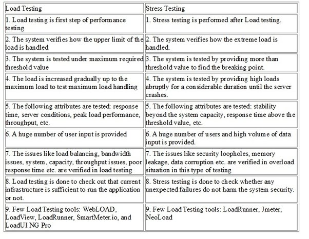
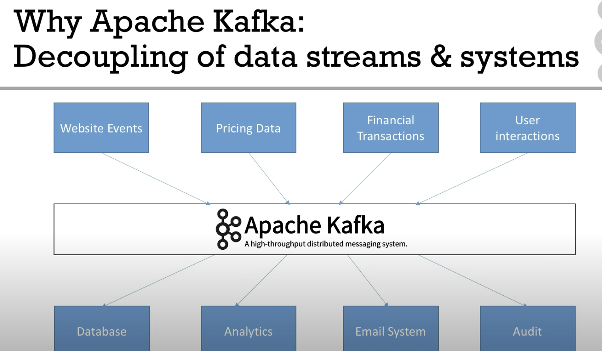

## February

### Feb 2

Symlink: https://medium.com/@alexishevia/the-magic-behind-npm-link-d94dcb3a81af

```js
npm link in node_modules/react in ETLD
npm link in node_module/react-dom in ETLD
npm link react react-dom in MCL
npm run build:package in MCL
npm link in MCL
npm link @matillion/component-library in ETLD
```

converting json to javascript object

## Feb 6

Always use classes, even for one item.
The reason is that inline style will be processed at the end of the rendering of the DOM, so the content will be rendered first with CSS, then re-rendered with the inline style. It creates delay and potentially flickering

## Feb 8

Look at css you tried for adding (optional)

## Feb 9

Look more into retrys

## Feb 22

> What is load testing? 
The most important part of performance testing. Provides loads less than/ equal to the desired load of an application.
Load is a quantity that only focuses on the number of users.

> What is stress testing? 
Checked the bahviour of the application once the load testing occurs. We only use stress testing when the application is completley stable. It is non-functional testing.

image

> What is K6?
It is an open source load testing tool. Return GO as the backend and testers can write tests in Javascript. Two flavours of K6 - open source and if you want to scale then you can use the k6 cloud.

To run `k6 run fileName.js`

`k6 version`

> What is Apache Kafka? DECOUPLING. Transportation mechanism. 

Created by Linkedin and maintained by confluence.
Each integration comes with difficulties around:
Types of protocols - How the data is transported: HTTP/ REST/ TCP/ FTP/ JDBC
Data format - How the data is parsed: Binary, CSV, JSON, Avro
Data schema and evolution - How the data is shaped and may chance

Each time you integrate a source system with a target system, the source system will have an increase in load from the connections

Apache Kafka allows you to decouple your data streams and systems.

image

High performance - latency of less than 10ms. Run time is really low which is great!

Apache Kafka - Use cases: messaging system ,activity tracking, gather metrics from many different locations, application logs gathering, stream processing, de-coupling of system dependencies, or perform big data integrations with spark, flink, storm, hadoop and many other big data technologies
