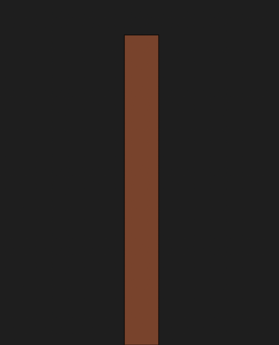
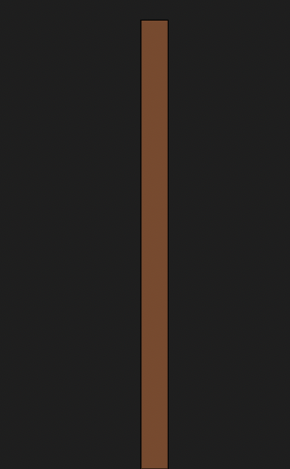

# November

## November 18, 22

```js
function setup() {
  // create a canvas
  createCanvas(windowWidth, windowHeight);
  // This was a really cool way to choose colours
  let width = random(30, 80);
  let height = random(400, 700);
  let red = random(100, 120);
  let green = random(60, 80);
  let blue = random(40, 50);
  // let color = rgb(random(180, 220), random());
  // colour the background black
  background(30);
  // select white as a colour
  fill(red, green, blue);
  // draw a rectangle
  rect(windowWidth / 2, windowHeight - height, width, height);
  rect(windowWidth / 2, windowHeight - height, width, height);
function draw() {}
```



