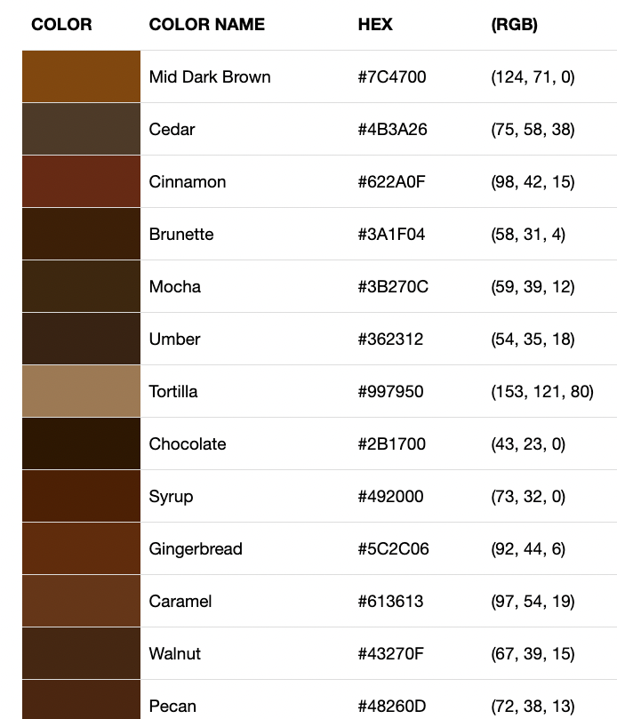

# November

## November 18, 22

> Making a tree trunk
> Things to consider:

1. The points on the canvas you want the react to sit.
2. The colours range you want by reloading everytime, should you use a randomiser to rerender everytime you reload?




```js
function setup() {
  // create a canvas
  createCanvas(windowWidth, windowHeight);
  // This was a really cool way to choose colours
  let width = random(30, 80);
  let height = random(400, 700);
  let red = random(100, 120);
  let green = random(60, 80);
  let blue = random(40, 50);
  // let color = rgb(random(180, 220), random());
  // colour the background black
  background(30);
  // select white as a colour
  fill(red, green, blue);
  // draw a rectangle
  rect(windowWidth / 2, windowHeight - height, width, height);
  rect(windowWidth / 2, windowHeight - height, width, height);
function draw() {}
```


Interesting tutorial: https://www.youtube.com/watch?v=HTCakn7pDs8

> If you wanted to draw a square using a polygon

```js
// Square
vertex(200, 200);
vertex(200, 800); // bottom point
vertex(800, 800);
vertex(800, 200); // bottom to right
```
