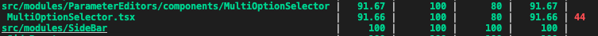
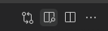
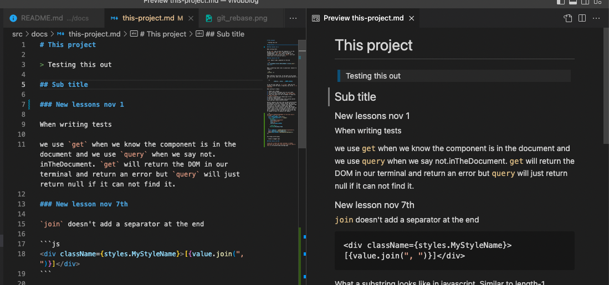

# Everyday Lessons

> I wanted to keep track of the everyday lessons I learn on the job. Mainly to track my progress but also to refer back to my own made rules.

## November 2022

### Nov 1, 22

1. When writing tests

We use `get` when we know the component is in the document and we use `query` when we say not.inTheDocument. `get` will return the DOM in our terminal and return an error but `query` will just return null if it can not find it.

### Nov 7, 22

> `join` doesn't add a separator at the end

```js
<div className={styles.MyStyleName}>[{value.join(", ")}]</div>
```

> What a substring looks like in javascript. Similar to length-1.

```js
.slice(0, -1)
```

> When creating a new array. If you want to two arrays into one array, make sure you do the spread operator i.e. `...`.

```js
items={[...value, ...DUMMY_VALUE]}
```

If you set your type to `() => void`, when you are testing it and the type is required, you can do `() => undefined`

> When wanting to rebase

1. Commit your changes
2. Pull from main and makes sure its up to date
3. Go back to your branch and say `git rebase main`
4. Then since there will be no changes to commit do `git push --force`
5. Look at screenshot git_rebase.png to see a successful rebase output
6. For more information https://docs.gitlab.com/ee/topics/git/git_rebase.html#force-push

> Network Requests

Network requests that have come up when entering data
The HyperText Transfer Protocol (HTTP) 503 Service Unavailable server error response code indicates that the server is not ready to handle the request
The HyperText Transfer Protocol (HTTP) 504 Gateway Timeout server error response code indicates that the server, while acting as a gateway or proxy, did not get a response in time from the upstream server that it needed in order to complete the request.

```js
it("should itemSelectedIsOpen to true once cog is clicked", async () => {
  const MOCK_ISOPEN = jest.fn();
  const { getByLabelText } = render(
    <MicroCta
      aria-label="cog-button"
      alt="transparent"
      size="sm"
      onClick={MOCK_ISOPEN}
    >
      <Icon.Cog />
    </MicroCta>Markdown Mode

  );
  const cogButton = getByLabelText("cog-button");
  await userEvent.click(cogButton);
  expect(MOCK_ISOPEN).toHaveBeenCalledTimes(1);
});
```

> Fun things worth doing:

Create a swagger spec

### Nov 8, 22

- Line 44 is where the code coverage is needed. Sometimes you can have from 32-44 lines you need to test.



- Viewing your ReadMe.md with the preview button in VS code.




### Nov 9, 22

> Server-side request forgery (SSRF)

You can visit a website, your browser is persuaded/ loaded from another resource to send requests to another site on your behalf. It used to be a big thing where developers were less aware of different request types. Now it can still be a thing. Where if you have wifi people can make different requests with that. An attack by the user frontend via the user browser. Attacker can get you to do things on your own behalf. CSRF -> Attack on the client. SSRF -> Attack on the server.

> Shortcuts of VS Code

To be honest sometimes it works and sometimes it doesnt and I get confused so I am just going to make a note of it here: Command Shift L allows us to do variable refactors.

> @TODOs in the codebase
> If youre going to have a TODO always have a link to the ticket it is referring to. You can set this up in linting apparently

> JSDoc versus normal comment

```js
**
 * @property {number} listHeight must match Column__TableList height
 * @property {number} itemSize must  must match ListItem height
 *
 **/

const defaultOptions: OptionProps = {
  listHeight: 354,
  itemSize: 48,
  [...]

```

```js
/** @keyword This is jsdoc that will come up when you hover over*/
```

versus

`// this is a comment`

You should not have an @ outside the js doc statement. Its not a keyword by javascript.

> Testing

Rather than destructure from render all the time, we should import screen from the test-utils import and then we get access to all these methods e.g. screen.getByText(). Deconstructed for all.

> Fun CSS
> text-overflow: ellipsis;

> `:global`
> global name not a module name. should not be used outside this condition. Used theme but should never be used outside of file. Breaking the idea of having a module. Only redefining the things based on theme.

> Translation

```js
 allItemsLabel: t('translation:itemSelector.allItemsLabel', {
                  label: parameter
                }),
```

`"allItemsLabel": "{{ label }}",`

> If empty array

items={data?.editorColumns[0].options ?? []}

> Plugin for i18y

https://marketplace.visualstudio.com/items?itemName=lokalise.i18n-ally

> Ignoring a line for typescript

`@ts-expect-error comment after this`

### Nov 14, 22

> Mocking data response from a hook

First you need to import the whole file/bundle where your hook is by doing \* and then renaming it as shown below in imports. Then what spy does is it "spies on"/ monitors every call to this hook in the spyOn block. Jest monitors it instead of returning it it will just return the mock return values.

```js
import * as GetOptions from "api/hooks/useGetOptions";

const spy = jest
  .spyOn(GetOptions, "useGetOptions")
  // .mockReturnValue(MOCK_RETURNVALUE)
  .mockImplementation(() => MOCK_RETURNVALUE);
```

LOOK AT HOW `as` is used here:

```js
 const spy = jest
      .spyOn(GetOptions, 'useGetOptions')
      .mockReturnValue(
        MOCK_RETURNVALUE as UseQueryResult<GetOptionsResponse>
      )

expect(spy).toHaveBeenCalled() // otherwise linting issue
```

> _Learning is part of the health check of Retro_

> Terminal Things

```js
rm -r fileIWantToDelete
git rm fileIWantDeleted
ls -al // views hidden files in the repo
```

> Typescript: Knowing when to use Partial

> Testing

- Wrapping everything in forEach when writing tests that have similar parameters. Just make two objects with the same values then put those two objects into a generic object. Then say `thatObject.forEach( ({deconstuctParamsFromObject}) => { // do shit })`

```js
  'data-testid': dataTestId
```

> Favourite VS Code Command Refactor

- SHIFT, CMD and L

> Quick one on data structures

- `const addingTwoArrays = [...ObjectName, AnotherObject]`

- `const justOneObject = [ObjectName]`

```js
export const mockJobTypeOneComponent = {
  name: "orchestration",
  instanceId: "14360",
};

export const mockJobTypeTwoComponent = {
  name: "orchestration",
  instanceId: "14360",
};

export const bothMockComponents = [
  mockJobTypeOneComponent,
  mockJobTypeTwoComponent,
];
```

Then you can do a

```js
import {bothMockComponents} from './somewhere'
bothMockComponents.forEach({name, instanceID}) => { stuff}`
```

Make this into a suppose class then import it.
